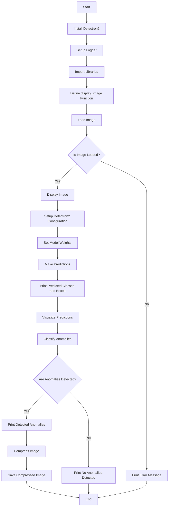

```mermaid
graph TD
    A[Start] --> B[Install Detectron2]
    B --> C[Setup Logger]
    C --> D[Import Libraries]
    D --> E[Define display_image Function]

    E --> F[Load Image]
    F --> G{Is Image Loaded?}
    G -- Yes --> H[Display Image]
    G -- No --> I[Print Error Message]
    H --> J[Setup Detectron2 Configuration]
    J --> K[Set Model Weights]
    K --> L[Make Predictions]
    L --> M[Print Predicted Classes and Boxes]
    M --> N[Visualize Predictions]
    N --> O[Classify Anomalies]
    O --> P{Are Anomalies Detected?}
    P -- Yes --> Q[Print Detected Anomalies]
    P -- No --> R[Print No Anomalies Detected]
    Q --> S[Compress Image]
    S --> T[Save Compressed Image]
    R --> U[End]
    I --> U
    T --> U
```
